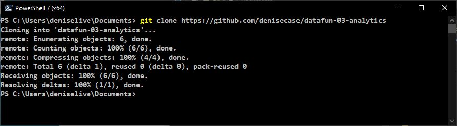
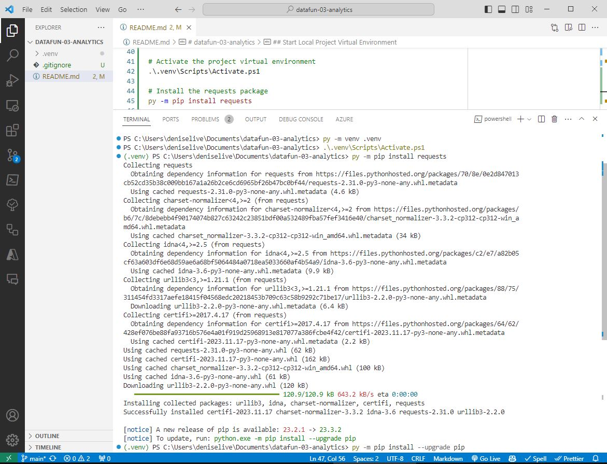
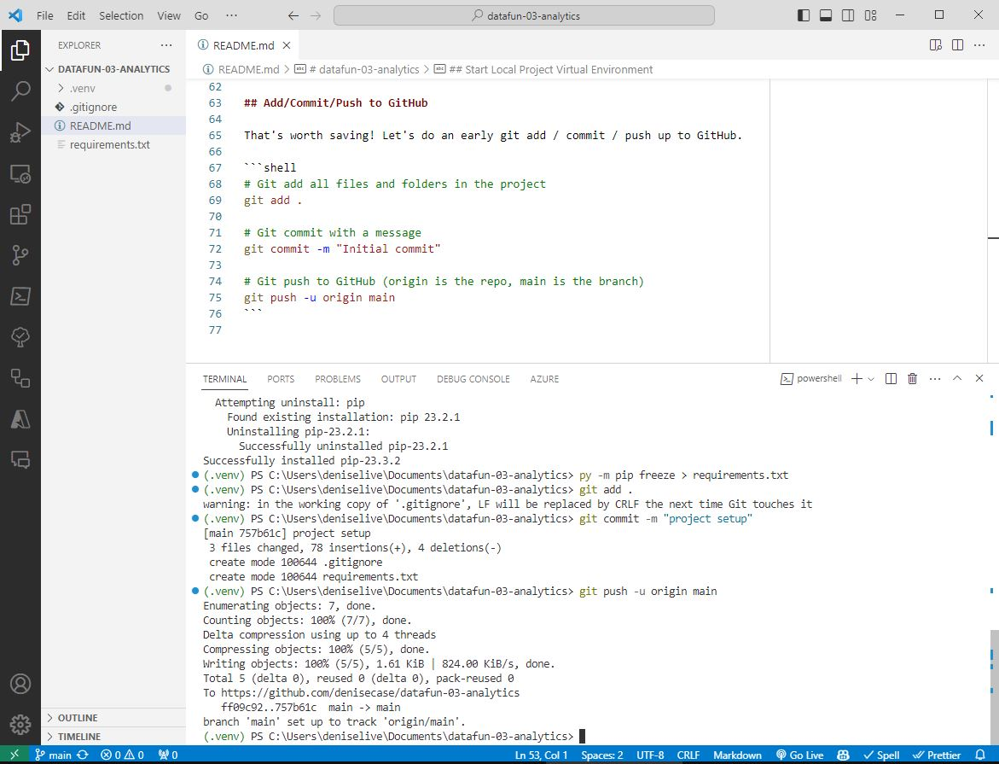
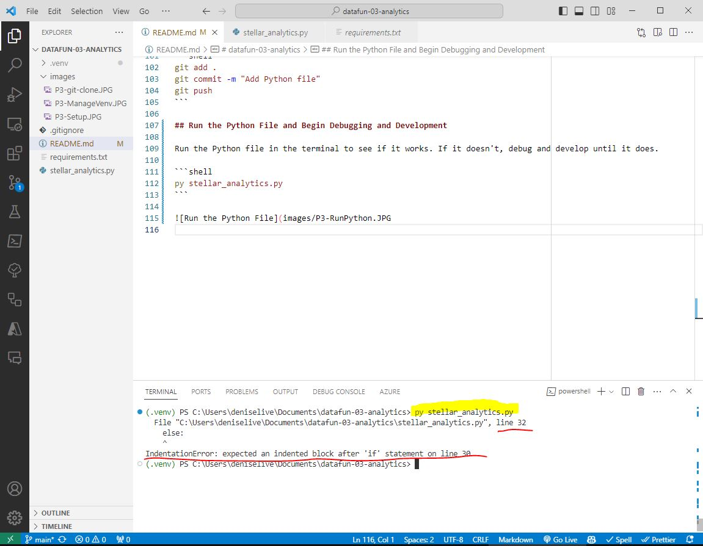
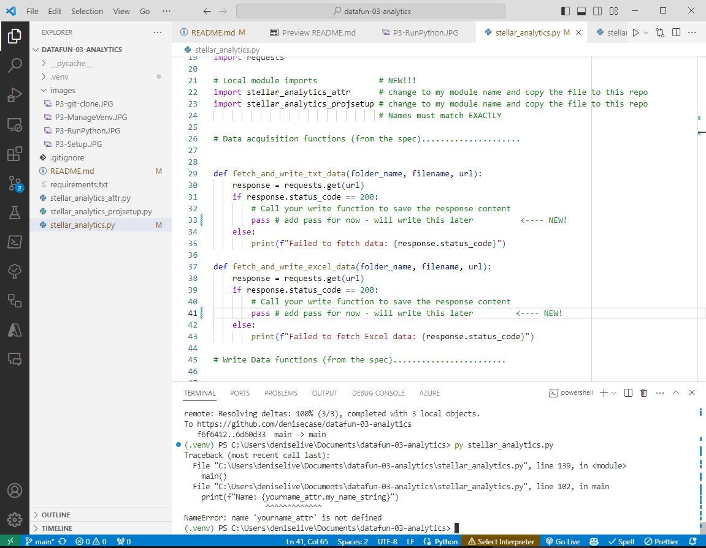
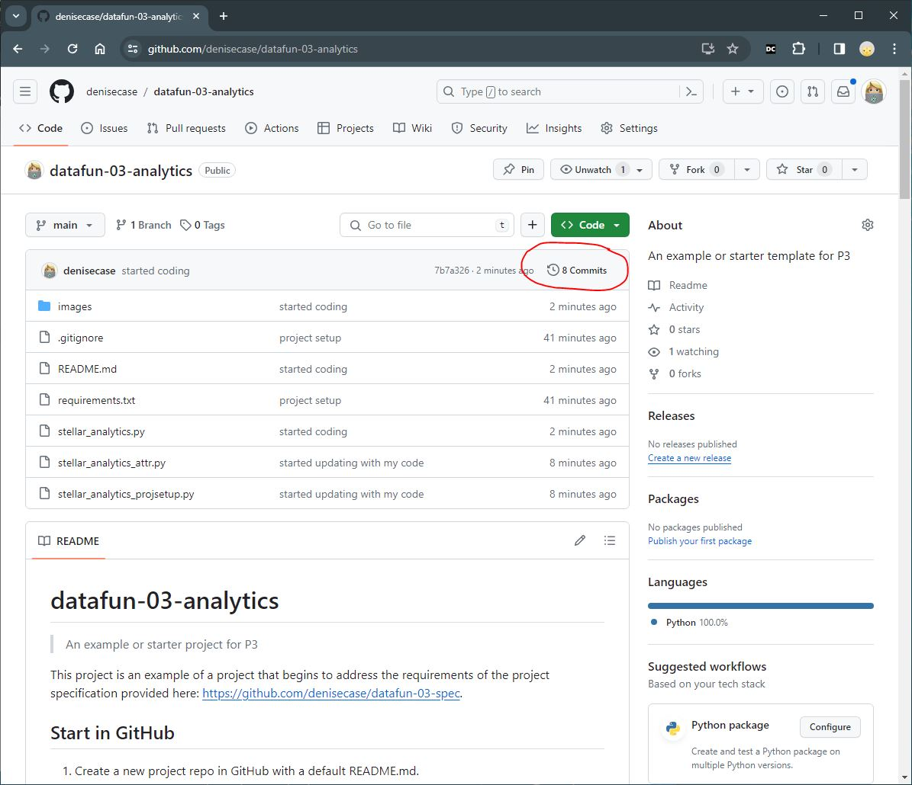

# datafun-03-analytics

> An example or starter project for P3

This project is an example of a project that begins to address the requirements of the project specification provided here: <https://github.com/denisecase/datafun-03-spec>.

## Start in GitHub

1. Create a new project repo in GitHub with a default README.md.
2. Go to the Project repo in GitHub and copy the URL to clipboard (e.g., <https://github.com/denisecase/datafun-03-analytics>)

## Switch to Local Machine and Clone

1. Open Native PowerShell (Windows) or Terminal (Mac/Linux) in **Documents** folder.
Type `git clone` and paste the project repo url, then hit ENTER to run.

```shell
git clone pasteURLhere
```



## Change to Root Project Folder and Open Project in VS Code

```shell
cd datafun-03-analytics
code .
```

## Start Local Project Virtual Environment

Open a new Terminal in VS Code (Menu: Terminal / New Terminal) and run these commands one at a time to create a virtual environment, activate it, and install the requests package.
Then, freeze the requirements information to a new requirements.txt file.
Wait patiently for each command to complete.

Example on Windows using VS Code PowerShell terminal:

```shell
# Create a project virtual environment
py -m venv .venv

# Activate the project virtual environment
.\.venv\Scripts\Activate.ps1

# Install the requests package
py -m pip install requests

# If prompted, upgrade pip with the recommended command
py -m pip install --upgrade pip

# Run pip freeze to see the current requirements 
# and redirect the output (>) to requirements.txt file
py -m pip freeze > requirements.txt
```



## Create a .gitignore file

Create a .gitignore file in the root of the project folder. See the example in this repo or the project specification repository.

## Update README.md

Update the README.md file to include the project name, description, and a link to the project specification.
Record the commands you used to get your project working.

## Add/Commit/Push to GitHub

That's worth saving! Let's do an early git add / commit / push up to GitHub.

```shell
# Git add all files and folders in the project
git add .

# Git commit with a message
git commit -m "Initial commit"

# Git push to GitHub (origin is the repo, main is the branch)
git push -u origin main
```



## Add the Python File

Create a new Python file in the root of the project folder.
Name it as required in the specification (aka spec).
And bring in all the information and requirements provided in the spec.
It should look like a typical Python module, including:

- opening docstring
- imports, organized
- comments for each function required
- main() function
- conditional execution block

## Again: Add/Commit/Push to GitHub

After sketching it out from the spec, repeat the add/commit/push process to save your work.

```shell
git add .
git commit -m "Add Python file"
git push
```

## Run the Python File and Begin Debugging and Development

Run the Python file in the terminal to see if it works.
If it doesn't, debug and develop until it does.

```shell
py stellar_analytics.py
```



## Update Code to Import Earlier Modules / Use pass to get it to run

If you have a module that you need to import, you can use the `pass` keyword to get the code to run without error. This is a good way to test your code in small pieces.

Here's what it looks like after getting started with the coding changes.



## Review the History in GitHub

To see the history of your project, click on the "Commits" link in GitHub.

For example: <https://github.com/denisecase/datafun-03-analytics/commits/main/>


