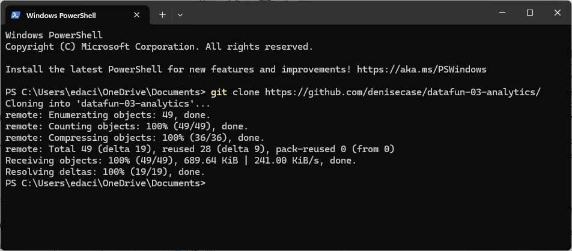

# Create a GitHub Repository and Clone it Down

The recommended, reliable way to start a new GitHub project is to begin in GitHub with at least one file in your repo. 


## 1. Create GitHub Repo

In this project, we're showing you how to build a new project on your own. 
To start, create a new project repo in GitHub **with a default README.md**. 
See Note 1.
  
When done (and you have at least one file in your repo), 
then, go to your new repo in GitHub and copy the URL to clipboard (e.g., <https://github.com/denisecase/datafun-03-analytics>)


## 2. Switch to Local Machine and Clone It Down

Open Native PowerShell (Windows) or Terminal (Mac/Linux) in your **Documents** folder.
Type `git clone` and paste the project repo url, then hit ENTER to run.

Change this command to use the URL of YOUR GitHub repository.

```shell
git clone https://github.com/denisecase/datafun-03-analytics
```




## Note 1

You could click the "Use this template" button to get a copy of this whole repo in your account. 
We recommend you continue to build the repo from scratch for the practice - keep doing what you've been doing and just add the example files manually. 
