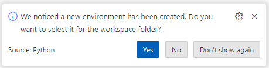

# Set Up Local Project Virtual Environment

When we use external packages (as we typically do), we want to work in an isolated virtual environment. 

We recommend creating one virtual environment per project which can be found in the .venv folder of our project repository. 

There are several steps:

1. Create it (generally only once)
2. Activate it (whenever we work on the project!)
3. Install packages as needed (must be active)

## Create

Open a new Terminal in VS Code (Menu: Terminal / New Terminal) and create it. 

In VS Code PowerShell terminal:

```shell
py -m venv .venv
```

If VS Code asks to use it, click Yes. 



## Activate (ALWAYS!)

In VS Code PowerShell terminal:

```shell
.\.venv\Scripts\Activate.ps1
```

Important! Remember to activate your .venv every time you open a terminal to work on your project. 

A "(.venv)" may appear in your terminal prompt. 

## Install Packages (as needed)

In VS Code PowerShell terminal:

Upgrade pip with the recommended command:

```shell
py -m pip install --upgrade pip
```

```shell
py -m pip install requests --upgrade
py -m pip install openpyxl --upgrade
```

